XXX what should the knit output be? XXX


# Acknowledgement
This R markdown file is adapted from the "Import_MCData" file created by Laurel Genge, Carlie Barnhill, Max Berthold, Mireille Savoie, and Douglas A. Campbell for the Plastic Degredation project by Heather MacTavish, Andrew Forrest, and Yvanna Tchatchoua in BIOL3111.

Dr. Campbell was supported by the Canada Research Chairs.

# Set Options {-}
## Set figure caption font size {-}
<style type="text/css">
p.caption {
  font-size: 18px;
}
</style>
## Set Chunk Options {-}


XXX get Yvanna and andrew to add their parts to this file


XXX write that this was by the original authors
# Introduction 

The PSI Multicultivator is used to grow 8 x 80 ml of phytoplankton
culture under a common temperature regime, with individual control of
bubbling, light level, light spectral quality and photoperiod for each
of the 8 culture tubes.

This .Rmd Rworkbook imports data in simple .csv long form exported from
PSI Multicultivators based upon project specific values for variables
set by the user.

It tidies and organizes the data. It uses a pivot_wider and
interpolation approach to get the Actinic_par and OD values in line
rowwise. This requires careful 'arrange' of the rows. It imports a
metadata catalog (Data/RawData/"CultureCatalog.Rds") and merges the metadata with the imported data based
upon shared values for the variables 'MC', 'Tube', and 'Filename' which
should unambiguously identify a given growth trajectory measured at
OD680 or OD720. OD680 of 0.005 and OD720 of 0.003 were used to replace measured OD values for tubes with OD680 and/or OD720 < 0 across the whole growth trajectory. Assigning these very low OD values acts as a place holder; otherwise data for these tubes get filtered out later and 'no growth' data are lost.

It generates preliminary data plots. It filters the data for outliers by
screening out values distant from the moving average of a window in the
stream; this requires careful 'arrange' of the rows so sequential rows
represent sequential time steps.

This works because the OD680 & OD720 data are only episodically, but
widely, aberrant when a bubble interrupts the measurement, and if the
Multicultivator is running properly these bubble aberration events are
rare.

# Load Libraries


# Set Project Variables

``` r
Project <- "Plastic"


# Multicultivator data files are too large to upload in a single .zip therefore 3 .zipped folders are uploaded. 

DataIn <- file.path("..", "Data", "RawData", "MultiCultiPlasticData.zip")

DataOut <- file.path("..","Data", "ProcessedData", "ImportedMCData")

# number of rows to skip upon read csv
Skip <- 20
```

#set Photobiology colors XXX

``` r
# Set colour codes for each WL of the Multicultivator. These colours are matched to WL using the Photobiology package. Colour codes used for visualization of spectral settings used in Muticulti run.

MyWavelengths = c(405, 450, 470, 530, 620, 660, 730, "WW")
MCMIXColours = c(c("purple", "blue", "skyblue", "green2",           "yellow", "red", "darkred", "black"))


names(MCMIXColours) <- MyWavelengths
MCMIXColours
```

```
##       405       450       470       530       620       660       730        WW 
##  "purple"    "blue" "skyblue"  "green2"  "yellow"     "red" "darkred"   "black"
```


``` r
CultureCatalog <- readRDS(file = file.path("..", "Data",  "RawData","CultureCatalog.Rds"))
```


# List previously imported MultiCulti files

``` r
list.files(path = DataOut, pattern = Project, full.names = TRUE)
```

```
## character(0)
```
# BioReactor Data

### List MultiCulti files for Project that are saved in DataIn

``` r
#List files in the extracted folder with a ".asc" extension
MCFiles <- unzip(DataIn, list = TRUE)
MCFiles <- MCFiles[grepl(".csv$", MCFiles$Name), "Name"]
print(MCFiles)
```

```
## [1] "20240927_Plastic_MCMIX004.csv" "20240927_Plastic_MCMIX006.csv"
```
## MCMIX004
### Set Target File and read in csv

``` r
TargetFile <- "20240927_Plastic_MCMIX004.csv"

# This opens a compressed file without decompressing.
TargetData <- read_csv(unz(DataIn, TargetFile),  
                       skip = Skip, 
                       id = "Path", 
                       col_names = c("key", "time", 
                                     "abs-time", "value")) %>% 
  separate(col =Path, into = c("Path", "Filename"), sep = ":") 

TargetFileName <- str_remove(string = TargetFile, pattern = ".csv")
TargetFileName
```

```
## [1] "20240927_Plastic_MCMIX004"
```

### Filter superfluous rows, Add ToD column, extract ExpDate, extract MC, 

``` r
#filter superfluous rows to simplify later pivot
TargetData <- TargetData %>%
  filter(str_detect(key, "od-720|od-680|actinic-lights.light")) %>%
  dplyr::select(key, time, `abs-time`, value, Filename) %>% 
  mutate(abs_time = mdy_hms(`abs-time`),
    Tube = str_extract(key, "-[:digit:]"),
         Tube = as.numeric(str_extract(Tube, "[:digit:]"))
         ) %>%
  dplyr::select(-`abs-time`)


#extract StartHour dynamically from first row of abs_time and display for cross check
StartHour <- as.numeric(format(TargetData$abs_time[1], format = "%H"))
StartHour
```

```
## [1] 6
```

``` r
StartDate <- TargetData$abs_time[1]
StartDate
```

```
## [1] "2024-09-27 06:00:00 UTC"
```

``` r
#Generate ToD as mod 24 of time + StartHour
TargetData <- TargetData %>%
  mutate(ToD = (time + StartHour) %% 24,
         Day = round((time/24), digits = 0))
#had trouble extracting 'Day' from abs_time, only got 3 unique values
  
#extract ExpDate for matching with Catalog
TargetData <- TargetData %>% 
    mutate(ExpDate = str_extract(Filename, "202[:digit:][:digit:][:digit:][:digit:][:digit:]_"),
           ExpDate = ymd(str_extract(ExpDate, "202[:digit:][:digit:][:digit:][:digit:][:digit:]")))

#extract MC for matching with Catalog
#fixed to run with MC or MCMIX.
#fixed to work for RUN #'s > 100. MC extracted from filename when Runs >99 returns the MC name and RUN #, this removes '_RUN#'
TargetData <- TargetData %>% 
    mutate(MC = str_extract(Filename, "MC.*[:digit:][:digit:][:digit:]"),
           MC = str_remove(MC, pattern = "\\_.*"))
```

## Create preliminary plot for TargetData (MCMIX004)
### Plots all OD values. True detection is OD680 and false detection is OD720.

``` r
  TargetData %>%
  filter(grepl("od-", key)) %>%
  ggplot(data = .) +
  geom_point(aes(x = time, y = value, colour = as.factor(str_detect(key, "680"))), size = 0.5) +
  geom_vline(aes(xintercept = 7 * 24), linetype = "dashed") + 
  geom_vline(aes(xintercept = 14 * 24), linetype = "dashed") + 
  scale_colour_manual(values = c("black", "red")) +
  labs(y = "Optical Density (OD)", x = "Elapsed Time (h)", title = "Tubes") +
  facet_grid(cols = vars(as.factor(Tube))) +
  theme_bw()
```

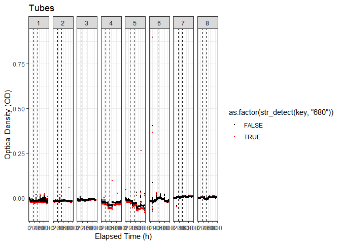<!-- -->

``` r
 TargetData %>%
  filter(grepl("od-", key)) %>%
  ggplot(data = .) +
  geom_point(aes(x = time, y = value, colour = as.factor(str_detect(key, "680"))), size = 0.5) +
   coord_cartesian(ylim = c(-0.1,0.1)) +
  geom_vline(aes(xintercept = 7 * 24), linetype = "dashed") + 
  geom_vline(aes(xintercept = 14 * 24), linetype = "dashed") + 
  scale_colour_manual(values = c("black", "red")) +
  labs(y = "Optical Density (OD)", x = "Elapsed Time (h)", title = "Tubes") +
  facet_grid(cols = vars(as.factor(Tube))) +
  theme_bw() 
```

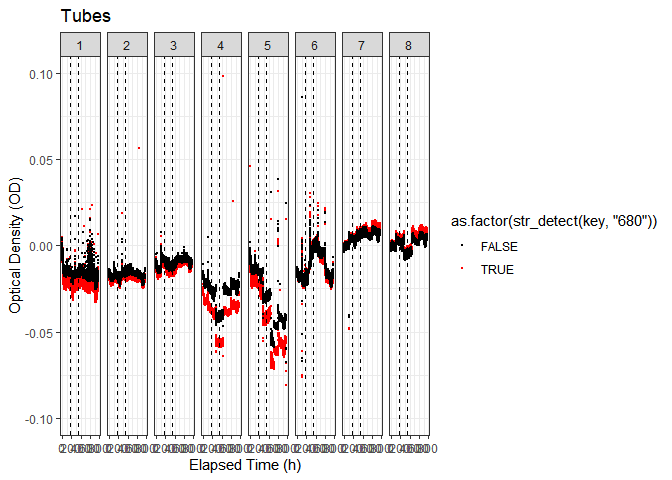<!-- -->

### Generate par_ue column with rows aligned with OD measures
Pivot_wider to get actinic-lights data aligned with relevant sensor
data. Need to include arrange(Filename, time, Tube) to keep things aligned! Need to
group_by and/or reorder rows appropriately; Be Careful


``` r
#possible issue with data structure; there are multiple values for some of the rows of actinic light columns, so the column becomes a list.
#Can add  values_fn = 
#to arbitrarily take the max or min etc. element of the list; but there might be a wider problem here when importing multiple files

TargetDataWide <- TargetData %>%
  pivot_wider(names_from = key, values_from = value, values_fn = list(value = max)) %>%
  arrange(Filename, MC, Tube, time)

TargetDataWide[1:10,]
```

```
## # A tibble: 10 × 32
##        time Filename      abs_time             Tube   ToD   Day ExpDate    MC   
##       <dbl> <chr>         <dttm>              <dbl> <dbl> <dbl> <date>     <chr>
##  1 0        20240927_Pla… 2024-09-27 06:00:00     1  6        0 2024-09-27 MCMI…
##  2 0.000278 20240927_Pla… 2024-09-27 06:00:00     1  6.00     0 2024-09-27 MCMI…
##  3 0.0833   20240927_Pla… 2024-09-27 06:00:30     1  6.08     0 2024-09-27 MCMI…
##  4 0.167    20240927_Pla… 2024-09-27 06:01:00     1  6.17     0 2024-09-27 MCMI…
##  5 0.191    20240927_Pla… 2024-09-27 06:01:09     1  6.19     0 2024-09-27 MCMI…
##  6 0.25     20240927_Pla… 2024-09-27 06:01:30     1  6.25     0 2024-09-27 MCMI…
##  7 0.331    20240927_Pla… 2024-09-27 06:01:59     1  6.33     0 2024-09-27 MCMI…
##  8 0.333    20240927_Pla… 2024-09-27 06:02:00     1  6.33     0 2024-09-27 MCMI…
##  9 0.417    20240927_Pla… 2024-09-27 06:02:30     1  6.42     0 2024-09-27 MCMI…
## 10 0.428    20240927_Pla… 2024-09-27 06:02:34     1  6.43     0 2024-09-27 MCMI…
## # ℹ 24 more variables: `actinic-lights.light-1-WW` <dbl>,
## #   `actinic-lights.light-2-WW` <dbl>, `actinic-lights.light-3-WW` <dbl>,
## #   `actinic-lights.light-4-WW` <dbl>, `actinic-lights.light-5-WW` <dbl>,
## #   `actinic-lights.light-6-WW` <dbl>, `actinic-lights.light-7-WW` <dbl>,
## #   `actinic-lights.light-8-WW` <dbl>, `od-sensors-1.od-680` <dbl>,
## #   `od-sensors-1.od-720` <dbl>, `od-sensors-2.od-680` <dbl>,
## #   `od-sensors-2.od-720` <dbl>, `od-sensors-3.od-680` <dbl>, …
```

``` r
rm(TargetData)
```

Actinic light values do not align time wise with OD measures.
Interpolate NA in actinic light columns from last observation, arrange
by MC & Tube Then generate Actinic_par summary column. If multiple lights
are activated, this chunk will give the summed par of all different
colours for the tube. If a single actinic light is activated per tube,
this gives the par for that tube. Filter rows where !is.na(Actinic_par)
to check for incorrect row sums.

Interpolation for Sine is not necessarily appropriate interpolation for
Square photoregime; issues with propagating last Actinic_par of
afternoon through evening, or back-casting first Actinic_par of morning.

Small glitching adding actinic_light values for tubes where
actinic_light column should be 0; issue with interpolation we think.


``` r
#http://publish.illinois.edu/spencer-guerrero/2014/12/11/2-dealing-with-missing-data-in-r-omit-approx-or-spline-part-1/
#https://dplyr.tidyverse.org/dev/articles/colwise.html
#Interpolation causes problems with final rows that repeat last value.

interpolate <- function(x){zoo::na.locf(x, na.rm = FALSE, fromLast = FALSE, type = "l", maxgap = Inf)}

#possible problem with actinic_par for MC data b/c actinic-lights.light1 = NA generates actinic_par of 0 b/c in rowSums na.rm = TRUE, which treats NA as 0.
#possibly not a big problem but watch for bugs
#na.rm = FALSE fails to run
TargetDataWide <- TargetDataWide %>%
  group_by(Tube) %>%
  arrange(Filename, MC, Tube, time) %>%
  mutate(across(.cols = starts_with("actinic-lights.light"), .fns = interpolate)) %>%
  ungroup() %>%
  mutate(Actinic_par = rowSums(.[grep("actinic-lights.light", names(.))], na.rm = TRUE)) %>%
  filter(!is.na(Actinic_par)) %>%
   dplyr::select(!contains("actinic-lights.light"))


TargetDataWide[1:10,]
```

```
## # A tibble: 10 × 25
##        time Filename      abs_time             Tube   ToD   Day ExpDate    MC   
##       <dbl> <chr>         <dttm>              <dbl> <dbl> <dbl> <date>     <chr>
##  1 0        20240927_Pla… 2024-09-27 06:00:00     1  6        0 2024-09-27 MCMI…
##  2 0.000278 20240927_Pla… 2024-09-27 06:00:00     1  6.00     0 2024-09-27 MCMI…
##  3 0.0833   20240927_Pla… 2024-09-27 06:00:30     1  6.08     0 2024-09-27 MCMI…
##  4 0.167    20240927_Pla… 2024-09-27 06:01:00     1  6.17     0 2024-09-27 MCMI…
##  5 0.191    20240927_Pla… 2024-09-27 06:01:09     1  6.19     0 2024-09-27 MCMI…
##  6 0.25     20240927_Pla… 2024-09-27 06:01:30     1  6.25     0 2024-09-27 MCMI…
##  7 0.331    20240927_Pla… 2024-09-27 06:01:59     1  6.33     0 2024-09-27 MCMI…
##  8 0.333    20240927_Pla… 2024-09-27 06:02:00     1  6.33     0 2024-09-27 MCMI…
##  9 0.417    20240927_Pla… 2024-09-27 06:02:30     1  6.42     0 2024-09-27 MCMI…
## 10 0.428    20240927_Pla… 2024-09-27 06:02:34     1  6.43     0 2024-09-27 MCMI…
## # ℹ 17 more variables: `od-sensors-1.od-680` <dbl>,
## #   `od-sensors-1.od-720` <dbl>, `od-sensors-2.od-680` <dbl>,
## #   `od-sensors-2.od-720` <dbl>, `od-sensors-3.od-680` <dbl>,
## #   `od-sensors-3.od-720` <dbl>, `od-sensors-4.od-680` <dbl>,
## #   `od-sensors-4.od-720` <dbl>, `od-sensors-5.od-680` <dbl>,
## #   `od-sensors-5.od-720` <dbl>, `od-sensors-6.od-680` <dbl>,
## #   `od-sensors-6.od-720` <dbl>, `od-sensors-7.od-680` <dbl>, …
```

Now that Actinic_par is aligned with each row, coalesce
od-sensors-X.od-720 and od-sensors-X.od-680 into 2 columns, b/c 'Tube'
is already a column, so no need to identify tube X in
od-sensors-X.od-680 columns. This might cause problems later matching OD
measures to actinic light colours.


``` r
TargetDataWide <- TargetDataWide  %>%
   mutate(OD680 = rowSums(.[grep("od-680", names(.))], na.rm = TRUE),
          OD720 = rowSums(.[grep("od-720", names(.))], na.rm = TRUE)) %>%
   dplyr::select(!contains("od-sensors"))

TargetDataWide[1:10,]
```

```
## # A tibble: 10 × 11
##        time Filename      abs_time             Tube   ToD   Day ExpDate    MC   
##       <dbl> <chr>         <dttm>              <dbl> <dbl> <dbl> <date>     <chr>
##  1 0        20240927_Pla… 2024-09-27 06:00:00     1  6        0 2024-09-27 MCMI…
##  2 0.000278 20240927_Pla… 2024-09-27 06:00:00     1  6.00     0 2024-09-27 MCMI…
##  3 0.0833   20240927_Pla… 2024-09-27 06:00:30     1  6.08     0 2024-09-27 MCMI…
##  4 0.167    20240927_Pla… 2024-09-27 06:01:00     1  6.17     0 2024-09-27 MCMI…
##  5 0.191    20240927_Pla… 2024-09-27 06:01:09     1  6.19     0 2024-09-27 MCMI…
##  6 0.25     20240927_Pla… 2024-09-27 06:01:30     1  6.25     0 2024-09-27 MCMI…
##  7 0.331    20240927_Pla… 2024-09-27 06:01:59     1  6.33     0 2024-09-27 MCMI…
##  8 0.333    20240927_Pla… 2024-09-27 06:02:00     1  6.33     0 2024-09-27 MCMI…
##  9 0.417    20240927_Pla… 2024-09-27 06:02:30     1  6.42     0 2024-09-27 MCMI…
## 10 0.428    20240927_Pla… 2024-09-27 06:02:34     1  6.43     0 2024-09-27 MCMI…
## # ℹ 3 more variables: Actinic_par <dbl>, OD680 <dbl>, OD720 <dbl>
```

## Merge Data with meta data

``` r
#This generates 'NA' values for ~1,000,000 rows of 'O2'; possibly the temperature rows?
TargetDataMeta <- left_join(x = TargetDataWide, y= CultureCatalog, by = c("MC", "Tube"))

TargetDataMeta
```

```
## # A tibble: 178,103 × 27
##        time Filename      abs_time             Tube   ToD   Day ExpDate    MC   
##       <dbl> <chr>         <dttm>              <dbl> <dbl> <dbl> <date>     <chr>
##  1 0        20240927_Pla… 2024-09-27 06:00:00     1  6        0 2024-09-27 MCMI…
##  2 0.000278 20240927_Pla… 2024-09-27 06:00:00     1  6.00     0 2024-09-27 MCMI…
##  3 0.0833   20240927_Pla… 2024-09-27 06:00:30     1  6.08     0 2024-09-27 MCMI…
##  4 0.167    20240927_Pla… 2024-09-27 06:01:00     1  6.17     0 2024-09-27 MCMI…
##  5 0.191    20240927_Pla… 2024-09-27 06:01:09     1  6.19     0 2024-09-27 MCMI…
##  6 0.25     20240927_Pla… 2024-09-27 06:01:30     1  6.25     0 2024-09-27 MCMI…
##  7 0.331    20240927_Pla… 2024-09-27 06:01:59     1  6.33     0 2024-09-27 MCMI…
##  8 0.333    20240927_Pla… 2024-09-27 06:02:00     1  6.33     0 2024-09-27 MCMI…
##  9 0.417    20240927_Pla… 2024-09-27 06:02:30     1  6.42     0 2024-09-27 MCMI…
## 10 0.428    20240927_Pla… 2024-09-27 06:02:34     1  6.43     0 2024-09-27 MCMI…
## # ℹ 178,093 more rows
## # ℹ 19 more variables: Actinic_par <dbl>, OD680 <dbl>, OD720 <dbl>,
## #   Identifier <chr>, Culture_Present <int>, Nutrient_Present <int>,
## #   Plastic_Present <int>, Temperature_C <int>,
## #   Initial_Plastic_Weight_mg <dbl>, Culture_Volume_mL <int>,
## #   Nutrient_Volume_mL <dbl>, Final_Plastic_Weight_mg <dbl>,
## #   Control_or_Replicate <chr>, WL <chr>, ExpStartDate <date>, …
```

``` r
rm(TargetDataWide)
```
## Prelim plot with culture meta (MCMIX004)

``` r
  TargetDataMeta %>% ggplot() +
  geom_point(aes(x = time, y = OD680, colour = as.factor(WL)), size = 0.15) +
  geom_point(aes(x = time, y = OD720), size = 0.15, colour = "orange") +
  #geom_point(aes(x = time, y = Actinic_par/1000),  colour = "orange", size = 0.0001) +
  geom_vline(aes(xintercept = 7 * 24), linetype = "dashed") + 
  geom_vline(aes(xintercept = 14 * 24), linetype = "dashed") + 
  #scale_x_continuous(breaks=seq(0, 800, by = 125)) +
  #coord_cartesian(xlim = c(-10, 800)) +
 # scale_colour_manual(values = MCMIXColours) +
  #labs(y = "Optical Density (OD)", x = "Elapsed Time (h)", subtitle = "Growth Light (µE); Strain; SampleID; Tube") +
  facet_grid(rows = vars(as.factor(Plastic_Present)), cols = vars(as.factor(Tube), Nutrient_Present, Culture_Present)) +
  theme_bw()
```

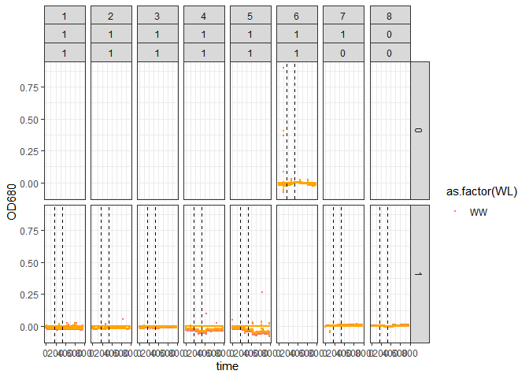<!-- -->


## MCMIX006
### Set Target File and read in csv

``` r
TargetFile <- "20240927_Plastic_MCMIX006.csv"


# This opens a compressed file without decompressing.
TargetData <- read_csv(unz(DataIn, TargetFile),  skip = Skip, id = "Path", col_names = c("key", "time", "abs-time", "value")) %>% 
  separate(col =Path, into = c("Path", "Filename"), sep = ":") 


TargetFileName <- str_remove(string = TargetFile, pattern = ".csv")

TargetFileName
```

```
## [1] "20240927_Plastic_MCMIX006"
```

### Filter superfluous rows, Add ToD column, extract ExpDate, extract MC,

``` r
#filter superfluous rows to simplify later pivot
TargetData <- TargetData %>%
  filter(str_detect(key, "od-720|od-680|actinic-lights.light"))
#head(TargetData)

# some files have "V5"  instead of "value" column
TargetData <- TargetData %>%
  dplyr::select(key, time, `abs-time`, value, Filename) %>% #, CDateTime
  mutate(Tube = str_extract(key, "-[:digit:]"),
         Tube = as.numeric(str_extract(Tube, "[:digit:]")),
         abs_time = mdy_hms(`abs-time`)) %>%
  dplyr::select(-`abs-time`)


#extract StartHour dynamically from first row of abs_time and display for cross check
StartHour <- as.numeric(format(TargetData$abs_time[1], format = "%H"))
StartHour
```

```
## [1] 6
```

``` r
StartDate <- TargetData$abs_time[1]
StartDate
```

```
## [1] "2024-09-27 06:00:00 UTC"
```

``` r
#Generate ToD as mod 24 of time + StartHour
TargetData <- TargetData %>%
  mutate(ToD = (time + StartHour) %% 24,
         Day = round((time/24), digits = 0))
#had trouble extracting 'Day' from abs_time, only got 3 unique values
  
#extract ExpDate for matching with Catalog
TargetData <- TargetData %>% 
    mutate(ExpDate = str_extract(Filename, "202[:digit:][:digit:][:digit:][:digit:][:digit:]_"),
           ExpDate = ymd(str_extract(ExpDate, "202[:digit:][:digit:][:digit:][:digit:][:digit:]")))

#extract MC for matching with Catalog
#fixed to run with MC or MCMIX.
#fixed to work for RUN #'s > 100. MC extracted from filename when Runs >99 returns the MC name and RUN #, this removes '_RUN#'
TargetData <- TargetData %>% 
    mutate(MC = str_extract(Filename, "MC.*[:digit:][:digit:][:digit:]"),
           MC = str_remove(MC, pattern = "\\_.*"))
```

## Create preliminary plot for TargetData MCMIX006
### Plots all OD values. True detection is OD680 and false detection is OD720.

``` r
  TargetData %>%
  filter(grepl("od-", key)) %>%
  ggplot(data = .) +
  geom_point(aes(x = time, y = value, colour = as.factor(str_detect(key, "680"))), size = 0.5) +
  geom_vline(aes(xintercept = 7 * 24), linetype = "dashed") + 
  geom_vline(aes(xintercept = 14 * 24), linetype = "dashed") + 
  scale_colour_manual(values = c("black", "red")) +
  labs(y = "Optical Density (OD)", x = "Elapsed Time (h)", title = "Tubes") +
  facet_grid(cols = vars(as.factor(Tube))) +
  theme_bw()
```

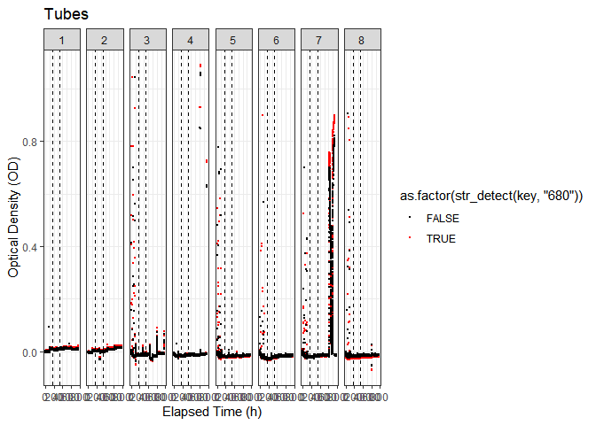<!-- -->

``` r
 TargetData %>%
  filter(grepl("od-", key)) %>%
  ggplot(data = .) +
  geom_point(aes(x = time, y = value, colour = as.factor(str_detect(key, "680"))), size = 0.5) +
   coord_cartesian(ylim = c(-0.1,0.1)) +
  geom_vline(aes(xintercept = 7 * 24), linetype = "dashed") + 
  geom_vline(aes(xintercept = 14 * 24), linetype = "dashed") + 
  scale_colour_manual(values = c("black", "red")) +
  labs(y = "Optical Density (OD)", x = "Elapsed Time (h)", title = "Tubes") +
  facet_grid(cols = vars(as.factor(Tube))) +
  theme_bw() 
```

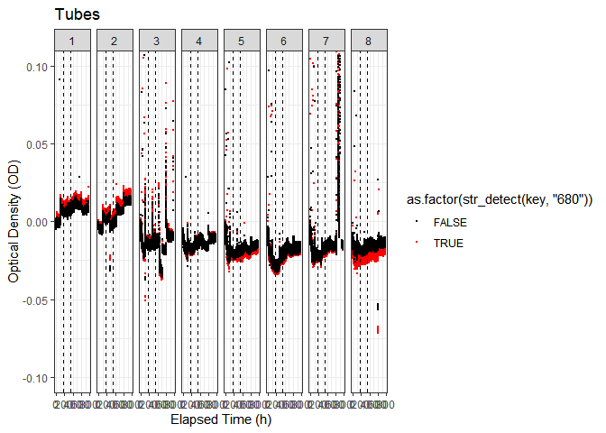<!-- -->


### Generate par_ue column with rows aligned with OD measures

Pivot_wider to get actinic-lights data aligned with relevant sensor
data. Need to include arrange(Filename, time, Tube) to keep things aligned! Need to
group_by and/or reorder rows appropriately; Be Careful


``` r
#possible issue with data structure; there are multiple values for some of the rows of actinic light columns, so the column becomes a list.
#Can add  values_fn = 
#to arbitrarily take the max or min etc. element of the list; but there might be a wider problem here when importing multiple files

TargetDataWide <- TargetData %>%
  pivot_wider(names_from = key, values_from = value, values_fn = list(value = max)) %>%
  arrange(Filename, MC, Tube, time)

TargetDataWide[1:10,]
```

```
## # A tibble: 10 × 32
##        time Filename       Tube abs_time              ToD   Day ExpDate    MC   
##       <dbl> <chr>         <dbl> <dttm>              <dbl> <dbl> <date>     <chr>
##  1 0        20240927_Pla…     1 2024-09-27 06:00:00  6        0 2024-09-27 MCMI…
##  2 0.000278 20240927_Pla…     1 2024-09-27 06:00:00  6.00     0 2024-09-27 MCMI…
##  3 0.0833   20240927_Pla…     1 2024-09-27 06:00:30  6.08     0 2024-09-27 MCMI…
##  4 0.167    20240927_Pla…     1 2024-09-27 06:01:00  6.17     0 2024-09-27 MCMI…
##  5 0.191    20240927_Pla…     1 2024-09-27 06:01:09  6.19     0 2024-09-27 MCMI…
##  6 0.25     20240927_Pla…     1 2024-09-27 06:01:30  6.25     0 2024-09-27 MCMI…
##  7 0.331    20240927_Pla…     1 2024-09-27 06:01:59  6.33     0 2024-09-27 MCMI…
##  8 0.333    20240927_Pla…     1 2024-09-27 06:02:00  6.33     0 2024-09-27 MCMI…
##  9 0.417    20240927_Pla…     1 2024-09-27 06:02:30  6.42     0 2024-09-27 MCMI…
## 10 0.428    20240927_Pla…     1 2024-09-27 06:02:34  6.43     0 2024-09-27 MCMI…
## # ℹ 24 more variables: `actinic-lights.light-1-WW` <dbl>,
## #   `actinic-lights.light-2-WW` <dbl>, `actinic-lights.light-3-WW` <dbl>,
## #   `actinic-lights.light-4-WW` <dbl>, `actinic-lights.light-5-WW` <dbl>,
## #   `actinic-lights.light-6-WW` <dbl>, `actinic-lights.light-7-WW` <dbl>,
## #   `actinic-lights.light-8-WW` <dbl>, `od-sensors-1.od-680` <dbl>,
## #   `od-sensors-1.od-720` <dbl>, `od-sensors-2.od-680` <dbl>,
## #   `od-sensors-2.od-720` <dbl>, `od-sensors-3.od-680` <dbl>, …
```

``` r
rm(TargetData)
```


``` r
#http://publish.illinois.edu/spencer-guerrero/2014/12/11/2-dealing-with-missing-data-in-r-omit-approx-or-spline-part-1/

#https://dplyr.tidyverse.org/dev/articles/colwise.html

#Interpolation causes problems with final rows that repeat last value.

interpolate <- function(x){zoo::na.locf(x, na.rm = FALSE, fromLast = FALSE, type = "l", maxgap = Inf)}

#possible problem with actinic_par for MC data b/c actinic-lights.light1 = NA generates actinic_par of 0 b/c in rowSums na.rm = TRUE, which treats NA as 0.
#possibly not a big problem but watch for bugs
#na.rm = FALSE fails to run
TargetDataWide <- TargetDataWide %>%
  group_by(Tube) %>%
  arrange(Filename, MC, Tube, time) %>%
  mutate(across(.cols = starts_with("actinic-lights.light"), .fns = interpolate)) %>%
  ungroup() %>%
  mutate(Actinic_par = rowSums(.[grep("actinic-lights.light", names(.))], na.rm = TRUE)) %>%
  filter(!is.na(Actinic_par)) %>%
   dplyr::select(!contains("actinic-lights.light"))


TargetDataWide[1:10,]
```

```
## # A tibble: 10 × 25
##        time Filename       Tube abs_time              ToD   Day ExpDate    MC   
##       <dbl> <chr>         <dbl> <dttm>              <dbl> <dbl> <date>     <chr>
##  1 0        20240927_Pla…     1 2024-09-27 06:00:00  6        0 2024-09-27 MCMI…
##  2 0.000278 20240927_Pla…     1 2024-09-27 06:00:00  6.00     0 2024-09-27 MCMI…
##  3 0.0833   20240927_Pla…     1 2024-09-27 06:00:30  6.08     0 2024-09-27 MCMI…
##  4 0.167    20240927_Pla…     1 2024-09-27 06:01:00  6.17     0 2024-09-27 MCMI…
##  5 0.191    20240927_Pla…     1 2024-09-27 06:01:09  6.19     0 2024-09-27 MCMI…
##  6 0.25     20240927_Pla…     1 2024-09-27 06:01:30  6.25     0 2024-09-27 MCMI…
##  7 0.331    20240927_Pla…     1 2024-09-27 06:01:59  6.33     0 2024-09-27 MCMI…
##  8 0.333    20240927_Pla…     1 2024-09-27 06:02:00  6.33     0 2024-09-27 MCMI…
##  9 0.417    20240927_Pla…     1 2024-09-27 06:02:30  6.42     0 2024-09-27 MCMI…
## 10 0.428    20240927_Pla…     1 2024-09-27 06:02:34  6.43     0 2024-09-27 MCMI…
## # ℹ 17 more variables: `od-sensors-1.od-680` <dbl>,
## #   `od-sensors-1.od-720` <dbl>, `od-sensors-2.od-680` <dbl>,
## #   `od-sensors-2.od-720` <dbl>, `od-sensors-3.od-680` <dbl>,
## #   `od-sensors-3.od-720` <dbl>, `od-sensors-4.od-680` <dbl>,
## #   `od-sensors-4.od-720` <dbl>, `od-sensors-5.od-680` <dbl>,
## #   `od-sensors-5.od-720` <dbl>, `od-sensors-6.od-680` <dbl>,
## #   `od-sensors-6.od-720` <dbl>, `od-sensors-7.od-680` <dbl>, …
```


``` r
TargetDataWide <- TargetDataWide  %>%
   mutate(OD680 = rowSums(.[grep("od-680", names(.))], na.rm = TRUE),
          OD720 = rowSums(.[grep("od-720", names(.))], na.rm = TRUE)) %>%
   dplyr::select(!contains("od-sensors"))

TargetDataWide[1:10,]
```

```
## # A tibble: 10 × 11
##        time Filename       Tube abs_time              ToD   Day ExpDate    MC   
##       <dbl> <chr>         <dbl> <dttm>              <dbl> <dbl> <date>     <chr>
##  1 0        20240927_Pla…     1 2024-09-27 06:00:00  6        0 2024-09-27 MCMI…
##  2 0.000278 20240927_Pla…     1 2024-09-27 06:00:00  6.00     0 2024-09-27 MCMI…
##  3 0.0833   20240927_Pla…     1 2024-09-27 06:00:30  6.08     0 2024-09-27 MCMI…
##  4 0.167    20240927_Pla…     1 2024-09-27 06:01:00  6.17     0 2024-09-27 MCMI…
##  5 0.191    20240927_Pla…     1 2024-09-27 06:01:09  6.19     0 2024-09-27 MCMI…
##  6 0.25     20240927_Pla…     1 2024-09-27 06:01:30  6.25     0 2024-09-27 MCMI…
##  7 0.331    20240927_Pla…     1 2024-09-27 06:01:59  6.33     0 2024-09-27 MCMI…
##  8 0.333    20240927_Pla…     1 2024-09-27 06:02:00  6.33     0 2024-09-27 MCMI…
##  9 0.417    20240927_Pla…     1 2024-09-27 06:02:30  6.42     0 2024-09-27 MCMI…
## 10 0.428    20240927_Pla…     1 2024-09-27 06:02:34  6.43     0 2024-09-27 MCMI…
## # ℹ 3 more variables: Actinic_par <dbl>, OD680 <dbl>, OD720 <dbl>
```

## Merge Data with meta data


``` r
#This generates 'NA' values for ~1,000,000 rows of 'O2'; possibly the temperature rows?
TargetDataMeta <- left_join(x = TargetDataWide, y= CultureCatalog, by = c("MC", "Tube"))

TargetDataMeta
```

```
## # A tibble: 178,093 × 27
##        time Filename       Tube abs_time              ToD   Day ExpDate    MC   
##       <dbl> <chr>         <dbl> <dttm>              <dbl> <dbl> <date>     <chr>
##  1 0        20240927_Pla…     1 2024-09-27 06:00:00  6        0 2024-09-27 MCMI…
##  2 0.000278 20240927_Pla…     1 2024-09-27 06:00:00  6.00     0 2024-09-27 MCMI…
##  3 0.0833   20240927_Pla…     1 2024-09-27 06:00:30  6.08     0 2024-09-27 MCMI…
##  4 0.167    20240927_Pla…     1 2024-09-27 06:01:00  6.17     0 2024-09-27 MCMI…
##  5 0.191    20240927_Pla…     1 2024-09-27 06:01:09  6.19     0 2024-09-27 MCMI…
##  6 0.25     20240927_Pla…     1 2024-09-27 06:01:30  6.25     0 2024-09-27 MCMI…
##  7 0.331    20240927_Pla…     1 2024-09-27 06:01:59  6.33     0 2024-09-27 MCMI…
##  8 0.333    20240927_Pla…     1 2024-09-27 06:02:00  6.33     0 2024-09-27 MCMI…
##  9 0.417    20240927_Pla…     1 2024-09-27 06:02:30  6.42     0 2024-09-27 MCMI…
## 10 0.428    20240927_Pla…     1 2024-09-27 06:02:34  6.43     0 2024-09-27 MCMI…
## # ℹ 178,083 more rows
## # ℹ 19 more variables: Actinic_par <dbl>, OD680 <dbl>, OD720 <dbl>,
## #   Identifier <chr>, Culture_Present <int>, Nutrient_Present <int>,
## #   Plastic_Present <int>, Temperature_C <int>,
## #   Initial_Plastic_Weight_mg <dbl>, Culture_Volume_mL <int>,
## #   Nutrient_Volume_mL <dbl>, Final_Plastic_Weight_mg <dbl>,
## #   Control_or_Replicate <chr>, WL <chr>, ExpStartDate <date>, …
```

``` r
rm(TargetDataWide)
```
# Prelim plot with culture meta data (MCMIX006)

``` r
  TargetDataMeta %>% ggplot() +
  geom_point(aes(x = time, y = OD680, colour = as.factor(WL)), size = 0.15) +
  geom_point(aes(x = time, y = OD720), size = 0.15, colour = "orange") +
  #geom_point(aes(x = time, y = Actinic_par/1000),  colour = "orange", size = 0.0001) +
  geom_vline(aes(xintercept = 7 * 24), linetype = "dashed") + 
  geom_vline(aes(xintercept = 14 * 24), linetype = "dashed") + 
  #scale_x_continuous(breaks=seq(0, 800, by = 125)) +
  #coord_cartesian(xlim = c(-10, 800)) +
  #scale_colour_manual(values = MCMIXColours) +
  #labs(y = "Optical Density (OD)", x = "Elapsed Time (h)", subtitle = "Growth Light (µE); Strain; SampleID; Tube") +
  facet_grid(rows = vars(as.factor(Plastic_Present)), cols = vars(as.factor(Tube), Nutrient_Present, Culture_Present)) +
  theme_bw()
```

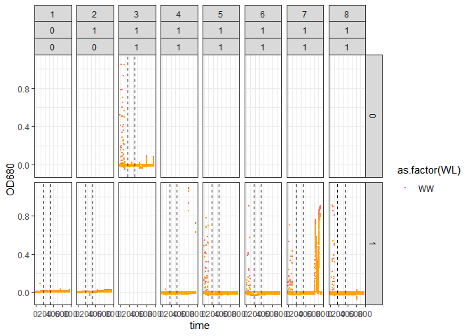<!-- -->


XXXLook at what you want for filtering
Fix meta catalog
do for both of the files
fix labels
as a formal practice segregate plastic (but fine for this project)
remove extra columns from meta


# Plastic Analyses

``` r
# make a new data set to not mess up the original
plastic <- CultureCatalog


# Calculate percentage change
plastic$perc_change <- (plastic$Final_Plastic_Weight_mg - plastic$Initial_Plastic_Weight_mg) / plastic$Initial_Plastic_Weight_mg * 100

plastic
```

```
##    Identifier Culture_Present Nutrient_Present Plastic_Present Temperature_C
## 1     CAPL001               1                1               1            25
## 2     CAPL002               1                1               1            25
## 3     CAPL003               1                1               1            25
## 4     CAPL004               1                1               1            25
## 5     CAPL005               1                1               1            25
## 6     CAPL006               1                1               0            25
## 7     CAPL007               0                1               1            25
## 8     CAPL008               0                0               1            25
## 9     CAPL009               0                0               1            15
## 10    CAPL010               0                1               1            15
## 11    CAPL011               1                1               0            15
## 12    CAPL012               1                1               1            15
## 13    CAPL013               1                1               1            15
## 14    CAPL014               1                1               1            15
## 15    CAPL015               1                1               1            15
## 16    CAPL016               1                1               1            15
##    Initial_Plastic_Weight_mg Culture_Volume_mL Nutrient_Volume_mL
## 1                     46.527                80                0.4
## 2                     40.403                80                0.4
## 3                     43.192                80                0.4
## 4                     32.477                80                0.4
## 5                     34.146                80                0.4
## 6                         NA                80                0.4
## 7                     33.221                80                0.4
## 8                     40.184                80                0.4
## 9                     39.983                80                0.4
## 10                    36.447                80                0.4
## 11                        NA                80                0.4
## 12                    43.026                80                0.4
## 13                    30.635                80                0.4
## 14                    46.416                80                0.4
## 15                    36.872                80                0.4
## 16                    44.694                80                0.4
##    Final_Plastic_Weight_mg Control_or_Replicate       MC Tube WL ExpStartDate
## 1                   44.367            Replicate MCMIX004    1 WW   2024-09-27
## 2                   41.216            Replicate MCMIX004    2 WW   2024-09-27
## 3                   43.108            Replicate MCMIX004    3 WW   2024-09-27
## 4                   38.700            Replicate MCMIX004    4 WW   2024-09-27
## 5                   32.732            Replicate MCMIX004    5 WW   2024-09-27
## 6                       NA              Control MCMIX004    6 WW   2024-09-27
## 7                   31.374              Control MCMIX004    7 WW   2024-09-27
## 8                   38.190              Control MCMIX004    8 WW   2024-09-27
## 9                   38.900              Control MCMIX006    1 WW   2024-09-27
## 10                  35.029              Control MCMIX006    2 WW   2024-09-27
## 11                      NA              Control MCMIX006    3 WW   2024-09-27
## 12                  31.009            Replicate MCMIX006    4 WW   2024-09-27
## 13                  29.660            Replicate MCMIX006    5 WW   2024-09-27
## 14                  44.780            Replicate MCMIX006    6 WW   2024-09-27
## 15                  35.579            Replicate MCMIX006    7 WW   2024-09-27
## 16                  41.765            Replicate MCMIX006    8 WW   2024-09-27
##             ExpEndDate Project Wall_Growth_RFU Suspension_RFU perc_change
## 1  2024-10-29 10:00:00 Plastic          249.58         11.580  -4.6424657
## 2  2024-10-29 10:00:00 Plastic         1019.53          3.755   2.0122268
## 3  2024-10-29 10:00:00 Plastic         1855.40          6.105  -0.1944805
## 4  2024-10-29 10:00:00 Plastic         2102.13         12.855  19.1612526
## 5  2024-10-29 10:00:00 Plastic          209.50          7.905  -4.1410414
## 6  2024-10-29 10:00:00 Plastic         1816.17          3.035          NA
## 7  2024-10-29 10:00:00 Plastic            0.57          0.180  -5.5597363
## 8  2024-10-29 10:00:00 Plastic            0.22          0.190  -4.9621740
## 9  2024-10-29 10:00:00 Plastic            0.24          0.225  -2.7086512
## 10 2024-10-29 10:00:00 Plastic            0.26          0.180  -3.8905808
## 11 2024-10-29 10:00:00 Plastic          339.73          8.210          NA
## 12 2024-10-29 10:00:00 Plastic          357.71          8.375 -27.9296239
## 13 2024-10-29 10:00:00 Plastic         1224.23          3.495  -3.1826342
## 14 2024-10-29 10:00:00 Plastic         1570.72          2.730  -3.5246467
## 15 2024-10-29 10:00:00 Plastic         1558.80          9.150  -3.5067260
## 16 2024-10-29 10:00:00 Plastic          769.38        136.380  -6.5534524
```

``` r
ggplot(plastic, aes(x = as.factor(Culture_Present), y = perc_change, fill = as.factor(Nutrient_Present))) +
  geom_boxplot() +
  labs(title = "Plastic Degradation Across Conditions", x = "Culture Present", y = "Percentage Change (%)") +
  theme_minimal()
```

```
## Warning: Removed 2 rows containing non-finite outside the scale range
## (`stat_boxplot()`).
```

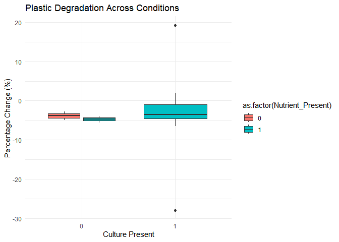<!-- -->


# Microbial Suspension and Wall Growth Analyses


``` r
# Scatter plot: microbial growth vs plastic degradation
ggplot(plastic, aes(x = perc_change, y = Wall_Growth_RFU, color = as.factor(Nutrient_Present))) +
  geom_point() +
  labs(title = "Plastic Degradation vs Microbial Growth", x = "Percentage Plastic Change (%)", y = "Wall Growth RFU") +
  theme_minimal()
```

```
## Warning: Removed 2 rows containing missing values or values outside the scale range
## (`geom_point()`).
```

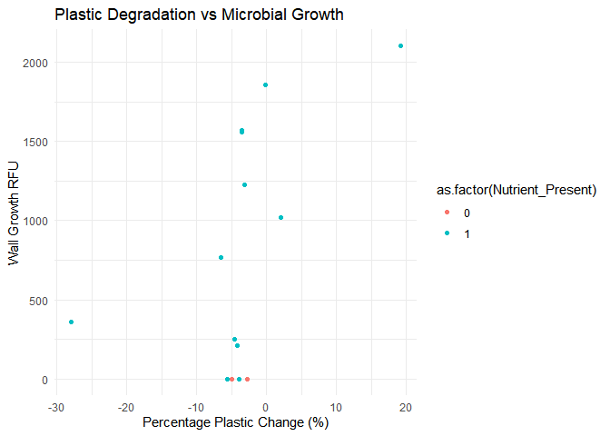<!-- -->


``` r
# ANOVA model
anova_model <- aov(perc_change ~ Culture_Present * Nutrient_Present * Temperature_C, data = plastic)
summary(anova_model)
```

```
##                                Df Sum Sq Mean Sq F value Pr(>F)
## Culture_Present                 1    3.0    3.03   0.029  0.869
## Nutrient_Present                1    0.8    0.79   0.008  0.933
## Temperature_C                   1  200.4  200.41   1.912  0.204
## Culture_Present:Temperature_C   1  127.1  127.11   1.213  0.303
## Nutrient_Present:Temperature_C  1    0.1    0.09   0.001  0.978
## Residuals                       8  838.5  104.81               
## 2 observations deleted due to missingness
```

``` r
# plot of the interactions
interaction.plot(plastic$Temperature_C, plastic$Culture_Present, plastic$perc_change,
                 col = 1:2, xlab = "Temperature", ylab = "Plastic Degradation (%)",
                 main = "Interaction Between Temperature and Culture")
```

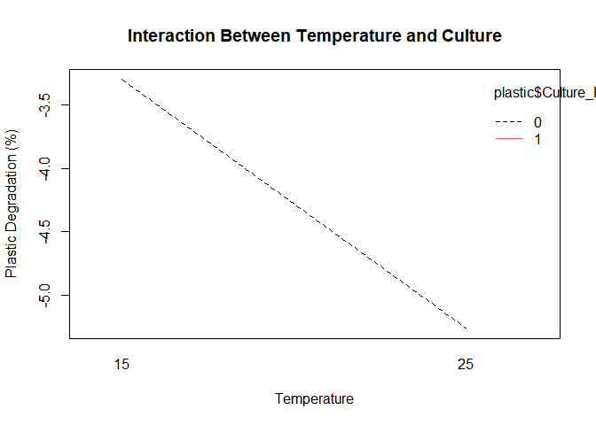<!-- -->

XXX

``` r
# Correlation matrix
library(reshape2)
```

```
## Warning: package 'reshape2' was built under R version 4.3.3
```

``` r
cor_data <- cor(plastic[, c("perc_change", "Wall_Growth_RFU", "Suspension_RFU")], use = "complete.obs")
cor_melt <- melt(cor_data)

# Heatmap
ggplot(cor_melt, aes(Var1, Var2, fill = value)) +
  geom_tile() +
  scale_fill_gradient2(low = "blue", high = "red", mid = "white", midpoint = 0) +
  labs(title = "Correlation Heatmap", fill = "Correlation") +
  theme_minimal()
```

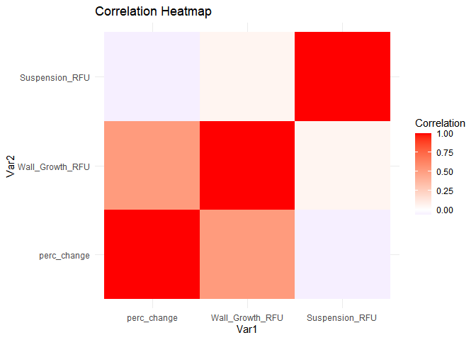<!-- -->


## converting the variables to factor type

``` r
# Convert grouping variables to factors 
plastic$Plastic_Present <- as.factor(plastic$Plastic_Present)
plastic$Nutrient_Present <- as.factor(plastic$Nutrient_Present)
plastic$Culture_Present <- as.factor(plastic$Culture_Present)
```


# Extra analyses

``` r
graph_data <- CultureCatalog %>%
  mutate(Weight_Loss_Percent = ((Initial_Plastic_Weight_mg - Final_Plastic_Weight_mg) / Initial_Plastic_Weight_mg) * 100)

graph_data$Culture_Present <- as.factor(graph_data$Culture_Present)

head(graph_data)
```

```
##   Identifier Culture_Present Nutrient_Present Plastic_Present Temperature_C
## 1    CAPL001               1                1               1            25
## 2    CAPL002               1                1               1            25
## 3    CAPL003               1                1               1            25
## 4    CAPL004               1                1               1            25
## 5    CAPL005               1                1               1            25
## 6    CAPL006               1                1               0            25
##   Initial_Plastic_Weight_mg Culture_Volume_mL Nutrient_Volume_mL
## 1                    46.527                80                0.4
## 2                    40.403                80                0.4
## 3                    43.192                80                0.4
## 4                    32.477                80                0.4
## 5                    34.146                80                0.4
## 6                        NA                80                0.4
##   Final_Plastic_Weight_mg Control_or_Replicate       MC Tube WL ExpStartDate
## 1                  44.367            Replicate MCMIX004    1 WW   2024-09-27
## 2                  41.216            Replicate MCMIX004    2 WW   2024-09-27
## 3                  43.108            Replicate MCMIX004    3 WW   2024-09-27
## 4                  38.700            Replicate MCMIX004    4 WW   2024-09-27
## 5                  32.732            Replicate MCMIX004    5 WW   2024-09-27
## 6                      NA              Control MCMIX004    6 WW   2024-09-27
##            ExpEndDate Project Wall_Growth_RFU Suspension_RFU
## 1 2024-10-29 10:00:00 Plastic          249.58         11.580
## 2 2024-10-29 10:00:00 Plastic         1019.53          3.755
## 3 2024-10-29 10:00:00 Plastic         1855.40          6.105
## 4 2024-10-29 10:00:00 Plastic         2102.13         12.855
## 5 2024-10-29 10:00:00 Plastic          209.50          7.905
## 6 2024-10-29 10:00:00 Plastic         1816.17          3.035
##   Weight_Loss_Percent
## 1           4.6424657
## 2          -2.0122268
## 3           0.1944805
## 4         -19.1612526
## 5           4.1410414
## 6                  NA
```

# Yvanna

``` r
data_long<-CultureCatalog%>%
  pivot_longer(cols=c(Initial_Plastic_Weight_mg,Final_Plastic_Weight_mg),names_to = "Weight_Type",values_to = "Weight")
data_long
```

```
## # A tibble: 32 × 18
##    Identifier Culture_Present Nutrient_Present Plastic_Present Temperature_C
##    <chr>                <int>            <int>           <int>         <int>
##  1 CAPL001                  1                1               1            25
##  2 CAPL001                  1                1               1            25
##  3 CAPL002                  1                1               1            25
##  4 CAPL002                  1                1               1            25
##  5 CAPL003                  1                1               1            25
##  6 CAPL003                  1                1               1            25
##  7 CAPL004                  1                1               1            25
##  8 CAPL004                  1                1               1            25
##  9 CAPL005                  1                1               1            25
## 10 CAPL005                  1                1               1            25
## # ℹ 22 more rows
## # ℹ 13 more variables: Culture_Volume_mL <int>, Nutrient_Volume_mL <dbl>,
## #   Control_or_Replicate <chr>, MC <chr>, Tube <int>, WL <chr>,
## #   ExpStartDate <date>, ExpEndDate <dttm>, Project <chr>,
## #   Wall_Growth_RFU <dbl>, Suspension_RFU <dbl>, Weight_Type <chr>,
## #   Weight <dbl>
```

``` r
#putting them in the right order
data_long$Weight_Type <- factor(data_long$Weight_Type, levels = c("Initial_Plastic_Weight_mg", "Final_Plastic_Weight_mg"))
```

``` r
ggplot(data_long,
       aes(x=Tube,y=Weight,fill=Weight_Type))+
  geom_bar(stat="identity",position="dodge")+
  scale_fill_manual(
    values=c("Initial_Plastic_Weight_mg"="lightblue",
             "Final_Plastic_Weight_mg"="red2"))+
  labs(x="Tube",y="Weight(mg)",fill="Weight Type")+
  facet_wrap(~ Temperature_C, labeller = labeller(Temperature_C = label_both)) +
  theme_minimal() +
  theme(
    strip.background = element_rect(fill = "lightgray", color = "black"), 
    strip.text = element_text(size = 9, face = "bold"), 
    panel.border = element_rect(color = "black", fill = NA, linewidth = 0.8)) 
```

```
## Warning: Removed 4 rows containing missing values or values outside the scale range
## (`geom_bar()`).
```

<!-- -->


``` r
ggplot(graph_data, aes(x = Temperature_C, y = Wall_Growth_RFU, colour = Culture_Present)) +
  geom_point(size = 3, alpha = 0.7) +
  labs(x = "Temperature (°C)", y = "Wall Growth RFU", 
       title = "Scatter Plot of Wall Growth RFU vs Temperature") +
  theme_minimal()
```

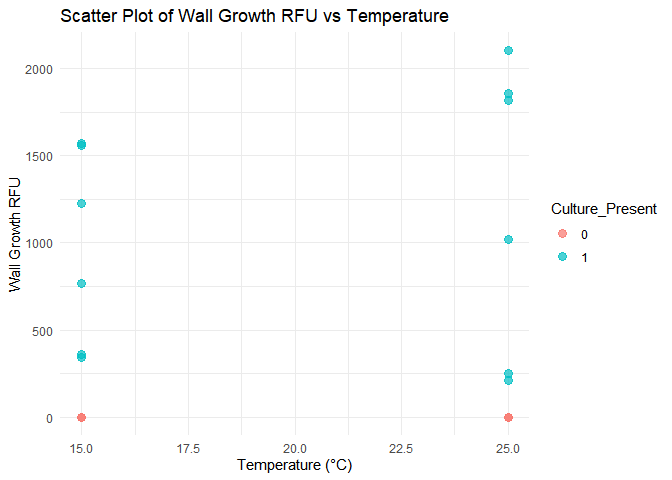<!-- -->

``` r
ggplot(graph_data, aes(x = Temperature_C, y = Suspension_RFU, colour = Culture_Present)) +
  geom_point(size = 3, alpha = 0.7) +
  labs(x = "Temperature (°C)", y = "Suspension RFU", 
       title = "Scatter Plot of Suspension RFU vs Temperature") +
  theme_minimal()
```

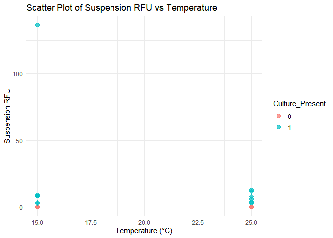<!-- -->


# Andrew
I will be running an ANOVA (one way) on change in plastic mass data (initial - end) for experimental groups
(5 tubes each) in 15 and 25 degrees celsius.

This will tell us whether the mean '% change in plastic weight' is significantly different between the 15 and 25 degree groups


``` r
filtered_dataplasticpresent<-CultureCatalog[CultureCatalog$Plastic_Present != 0,]
```


``` r
onewayanova_mass<-aov((filtered_dataplasticpresent$Initial_Plastic_Weight_mg-filtered_dataplasticpresent$Final_Plastic_Weight_mg)~filtered_dataplasticpresent$Temperature_C)
summary(onewayanova_mass)
```

```
##                                           Df Sum Sq Mean Sq F value Pr(>F)
## filtered_dataplasticpresent$Temperature_C  1  31.16   31.16   2.497   0.14
## Residuals                                 12 149.76   12.48
```

Factorial ANOVA using temperature, culture presence, and nutrient presence as independent variables.
This will tell us whether any one of these variables or some combination have a statistically significant effect on change in plastic mass.

``` r
factorialanova_mass<-aov((filtered_dataplasticpresent$Initial_Plastic_Weight_mg-filtered_dataplasticpresent$Final_Plastic_Weight_mg)~filtered_dataplasticpresent$Temperature_C*filtered_dataplasticpresent$Culture_Present*filtered_dataplasticpresent$Nutrient_Present)
summary(factorialanova_mass)
```

```
##                                                                                        Df
## filtered_dataplasticpresent$Temperature_C                                               1
## filtered_dataplasticpresent$Culture_Present                                             1
## filtered_dataplasticpresent$Nutrient_Present                                            1
## filtered_dataplasticpresent$Temperature_C:filtered_dataplasticpresent$Culture_Present   1
## filtered_dataplasticpresent$Temperature_C:filtered_dataplasticpresent$Nutrient_Present  1
## Residuals                                                                               8
##                                                                                        Sum Sq
## filtered_dataplasticpresent$Temperature_C                                               31.16
## filtered_dataplasticpresent$Culture_Present                                              0.00
## filtered_dataplasticpresent$Nutrient_Present                                             0.01
## filtered_dataplasticpresent$Temperature_C:filtered_dataplasticpresent$Culture_Present   18.69
## filtered_dataplasticpresent$Temperature_C:filtered_dataplasticpresent$Nutrient_Present   0.06
## Residuals                                                                              131.00
##                                                                                        Mean Sq
## filtered_dataplasticpresent$Temperature_C                                               31.165
## filtered_dataplasticpresent$Culture_Present                                              0.004
## filtered_dataplasticpresent$Nutrient_Present                                             0.009
## filtered_dataplasticpresent$Temperature_C:filtered_dataplasticpresent$Culture_Present   18.692
## filtered_dataplasticpresent$Temperature_C:filtered_dataplasticpresent$Nutrient_Present   0.058
## Residuals                                                                               16.375
##                                                                                        F value
## filtered_dataplasticpresent$Temperature_C                                                1.903
## filtered_dataplasticpresent$Culture_Present                                              0.000
## filtered_dataplasticpresent$Nutrient_Present                                             0.001
## filtered_dataplasticpresent$Temperature_C:filtered_dataplasticpresent$Culture_Present    1.142
## filtered_dataplasticpresent$Temperature_C:filtered_dataplasticpresent$Nutrient_Present   0.004
## Residuals                                                                                     
##                                                                                        Pr(>F)
## filtered_dataplasticpresent$Temperature_C                                               0.205
## filtered_dataplasticpresent$Culture_Present                                             0.988
## filtered_dataplasticpresent$Nutrient_Present                                            0.982
## filtered_dataplasticpresent$Temperature_C:filtered_dataplasticpresent$Culture_Present   0.317
## filtered_dataplasticpresent$Temperature_C:filtered_dataplasticpresent$Nutrient_Present  0.954
## Residuals
```

One way ANOVAs for chlorophyll assay readings using temp as independent variable (one ANOVA for wall growth and another for suspension)...

``` r
onewayanova_rfuwall<-aov(CultureCatalog$Wall_Growth_RFU~CultureCatalog$Temperature_C)
summary(onewayanova_rfuwall)
```

```
##                              Df  Sum Sq Mean Sq F value Pr(>F)
## CultureCatalog$Temperature_C  1  128169  128169   0.206  0.657
## Residuals                    14 8725092  623221
```

``` r
onewayanova_rfususpension<-aov(CultureCatalog$Suspension_RFU~CultureCatalog$Temperature_C)
summary(onewayanova_rfususpension)
```

```
##                              Df Sum Sq Mean Sq F value Pr(>F)
## CultureCatalog$Temperature_C  1    948   947.7   0.859   0.37
## Residuals                    14  15444  1103.1
```
Factorial ANOVAs for chlorophyll assay readings using temp, nutrient presence, plastic presence and culture presence as independent variables...

``` r
factorialanova_rfuwall<-aov(CultureCatalog$Wall_Growth_RFU~CultureCatalog$Temperature_C*CultureCatalog$Culture_Present*CultureCatalog$Nutrient_Present*CultureCatalog$Plastic_Present)
summary(factorialanova_rfuwall)
```

```
##                                                              Df  Sum Sq Mean Sq
## CultureCatalog$Temperature_C                                  1  128169  128169
## CultureCatalog$Culture_Present                                1 3558313 3558313
## CultureCatalog$Nutrient_Present                               1       0       0
## CultureCatalog$Plastic_Present                                1     315     315
## CultureCatalog$Temperature_C:CultureCatalog$Culture_Present   1   42654   42654
## CultureCatalog$Temperature_C:CultureCatalog$Nutrient_Present  1       0       0
## CultureCatalog$Temperature_C:CultureCatalog$Plastic_Present   1  919314  919314
## Residuals                                                     8 4204496  525562
##                                                              F value Pr(>F)  
## CultureCatalog$Temperature_C                                   0.244 0.6347  
## CultureCatalog$Culture_Present                                 6.770 0.0315 *
## CultureCatalog$Nutrient_Present                                0.000 0.9998  
## CultureCatalog$Plastic_Present                                 0.001 0.9811  
## CultureCatalog$Temperature_C:CultureCatalog$Culture_Present    0.081 0.7830  
## CultureCatalog$Temperature_C:CultureCatalog$Nutrient_Present   0.000 0.9998  
## CultureCatalog$Temperature_C:CultureCatalog$Plastic_Present    1.749 0.2225  
## Residuals                                                                    
## ---
## Signif. codes:  0 '***' 0.001 '**' 0.01 '*' 0.05 '.' 0.1 ' ' 1
```

``` r
factorialanova_rfususpension<-aov(CultureCatalog$Suspension_RFU~CultureCatalog$Temperature_C*CultureCatalog$Culture_Present*CultureCatalog$Nutrient_Present*CultureCatalog$Plastic_Present)
summary(factorialanova_rfususpension)
```

```
##                                                              Df Sum Sq Mean Sq
## CultureCatalog$Temperature_C                                  1    948   947.7
## CultureCatalog$Culture_Present                                1    930   929.7
## CultureCatalog$Nutrient_Present                               1      0     0.0
## CultureCatalog$Plastic_Present                                1    356   355.8
## CultureCatalog$Temperature_C:CultureCatalog$Culture_Present   1    315   315.2
## CultureCatalog$Temperature_C:CultureCatalog$Nutrient_Present  1      0     0.0
## CultureCatalog$Temperature_C:CultureCatalog$Plastic_Present   1    141   141.2
## Residuals                                                     8  13702  1712.7
##                                                              F value Pr(>F)
## CultureCatalog$Temperature_C                                   0.553  0.478
## CultureCatalog$Culture_Present                                 0.543  0.482
## CultureCatalog$Nutrient_Present                                0.000  0.999
## CultureCatalog$Plastic_Present                                 0.208  0.661
## CultureCatalog$Temperature_C:CultureCatalog$Culture_Present    0.184  0.679
## CultureCatalog$Temperature_C:CultureCatalog$Nutrient_Present   0.000  1.000
## CultureCatalog$Temperature_C:CultureCatalog$Plastic_Present    0.082  0.781
## Residuals
```


# more analyses 
XXX fix these

``` r
# Summary statistics for Final_Plastic_Weight_mg
plastic %>%
  group_by(Culture_Present, Nutrient_Present, Plastic_Present, Temperature_C) %>%
  summarise(
    mean_wall_rfu = mean(Wall_Growth_RFU, na.rm = TRUE),
    mean_susp_rfu = mean(Suspension_RFU, na.rm = TRUE)
  )
```

```
## # A tibble: 8 × 6
## # Groups:   Culture_Present, Nutrient_Present, Plastic_Present [4]
##   Culture_Present Nutrient_Present Plastic_Present Temperature_C mean_wall_rfu
##   <fct>           <fct>            <fct>                   <int>         <dbl>
## 1 0               0                1                          15          0.24
## 2 0               0                1                          25          0.22
## 3 0               1                1                          15          0.26
## 4 0               1                1                          25          0.57
## 5 1               1                0                          15        340.  
## 6 1               1                0                          25       1816.  
## 7 1               1                1                          15       1096.  
## 8 1               1                1                          25       1087.  
## # ℹ 1 more variable: mean_susp_rfu <dbl>
```


``` r
# Add a column for Percent Weight Loss
plastic <- plastic %>%
  mutate(
    Percent_Weight_Loss = ((Initial_Plastic_Weight_mg - Final_Plastic_Weight_mg) / Initial_Plastic_Weight_mg) * 100
  )
plastic <- plastic %>%
  mutate(
    Temperature_C = as.factor(Temperature_C),
    Culture_Present = as.factor(Culture_Present),
    Nutrient_Present = as.factor(Nutrient_Present)
  )


# Two-way ANOVA for Percent Weight Loss
weight_loss_anova <- aov(Percent_Weight_Loss ~ Temperature_C * Culture_Present * Nutrient_Present, data = plastic)
summary(weight_loss_anova)
```

```
##                                Df Sum Sq Mean Sq F value Pr(>F)
## Temperature_C                   1  200.4  200.41   1.912  0.204
## Culture_Present                 1    3.0    3.03   0.029  0.869
## Nutrient_Present                1    0.8    0.79   0.008  0.933
## Temperature_C:Culture_Present   1  127.1  127.11   1.213  0.303
## Temperature_C:Nutrient_Present  1    0.1    0.09   0.001  0.978
## Residuals                       8  838.5  104.81               
## 2 observations deleted due to missingness
```

``` r
# Tukey HSD for pairwise comparisons
TukeyHSD(weight_loss_anova)
```

```
##   Tukey multiple comparisons of means
##     95% family-wise confidence level
## 
## Fit: aov(formula = Percent_Weight_Loss ~ Temperature_C * Culture_Present * Nutrient_Present, data = plastic)
## 
## $Temperature_C
##            diff       lwr      upr     p adj
## 25-15 -7.567128 -20.18628 5.052022 0.2040942
## 
## $Culture_Present
##          diff       lwr      upr     p adj
## 1-0 -1.030126 -14.99697 12.93671 0.8691699
## 
## $Nutrient_Present
##          diff       lwr      upr     p adj
## 1-0 0.5190185 -17.51209 18.55013 0.9487062
## 
## $`Temperature_C:Culture_Present`
##                 diff       lwr       upr     p adj
## 25:0-15:0   1.961339 -30.82350 34.746183 0.9972974
## 15:1-15:0   5.639801 -21.78997 33.069569 0.9096682
## 25:1-15:0  -5.738714 -33.16848 21.691054 0.9055133
## 15:1-25:0   3.678461 -23.75131 31.108230 0.9717385
## 25:1-25:0  -7.700054 -35.12982 19.729715 0.8059029
## 25:1-15:1 -11.378515 -32.11347  9.356441 0.3577436
## 
## $`Temperature_C:Nutrient_Present`
##                diff       lwr      upr     p adj
## 25:0-15:0 -7.274944 -53.63972 39.08983 0.9562210
## 15:1-15:0  0.689459 -34.72222 36.10114 0.9999053
## 25:1-15:0 -6.926366 -42.33805 28.48531 0.9207083
## 15:1-25:0  7.964403 -27.44728 43.37608 0.8863637
## 25:1-25:0  0.348578 -35.06310 35.76026 0.9999877
## 25:1-15:1 -7.615825 -26.54416 11.31251 0.5941466
```


``` r
# Two-way ANOVA for Wall_Growth_RFU
rfu_anova <- aov(Wall_Growth_RFU ~ Temperature_C * Culture_Present * Nutrient_Present, data = plastic)
summary(rfu_anova)
```

```
##                                Df  Sum Sq Mean Sq F value Pr(>F)  
## Temperature_C                   1  128169  128169   0.250 0.6278  
## Culture_Present                 1 3558313 3558313   6.944 0.0249 *
## Nutrient_Present                1       0       0   0.000 0.9998  
## Temperature_C:Culture_Present   1   42654   42654   0.083 0.7788  
## Temperature_C:Nutrient_Present  1       0       0   0.000 0.9998  
## Residuals                      10 5124125  512413                 
## ---
## Signif. codes:  0 '***' 0.001 '**' 0.01 '*' 0.05 '.' 0.1 ' ' 1
```

``` r
# Linear regression for RFU vs Percent Weight Loss
rfu_regression <- lm(Percent_Weight_Loss ~ Wall_Growth_RFU + Suspension_RFU, data = plastic)
summary(rfu_regression)
```

```
## 
## Call:
## lm(formula = Percent_Weight_Loss ~ Wall_Growth_RFU + Suspension_RFU, 
##     data = plastic)
## 
## Residuals:
##     Min      1Q  Median      3Q     Max 
## -14.112  -3.609  -2.454   3.567  21.814 
## 
## Coefficients:
##                  Estimate Std. Error t value Pr(>|t|)  
## (Intercept)      8.211879   3.522514   2.331   0.0398 *
## Wall_Growth_RFU -0.006467   0.003186  -2.030   0.0673 .
## Suspension_RFU   0.025928   0.068969   0.376   0.7141  
## ---
## Signif. codes:  0 '***' 0.001 '**' 0.01 '*' 0.05 '.' 0.1 ' ' 1
## 
## Residual standard error: 8.776 on 11 degrees of freedom
##   (2 observations deleted due to missingness)
## Multiple R-squared:  0.2758,	Adjusted R-squared:  0.1442 
## F-statistic: 2.095 on 2 and 11 DF,  p-value: 0.1695
```

``` r
# Scatterplot of RFU vs Percent Weight Loss
ggplot(plastic, aes(x = Wall_Growth_RFU, y = Percent_Weight_Loss, color = Temperature_C)) +
  geom_point() +
  geom_smooth(method = "lm", se = TRUE) +
  labs(x = "Wall Growth RFU", y = "Percent Weight Loss")
```

```
## Warning: Removed 2 rows containing non-finite outside the scale range
## (`stat_smooth()`).
```

```
## Warning: Removed 2 rows containing missing values or values outside the scale range
## (`geom_point()`).
```

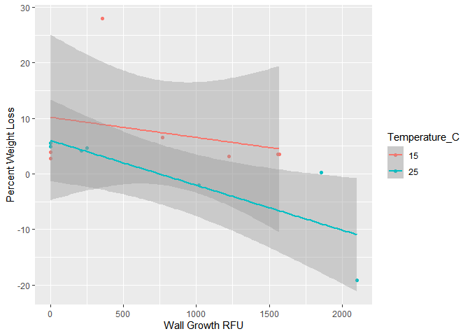<!-- -->


``` r
# T-test for weight loss by temperature
t.test(Percent_Weight_Loss ~ Temperature_C, data = plastic)
```

```
## 
## 	Welch Two Sample t-test
## 
## data:  Percent_Weight_Loss by Temperature_C
## t = 1.575, df = 11.98, p-value = 0.1413
## alternative hypothesis: true difference in means between group 15 and group 25 is not equal to 0
## 95 percent confidence interval:
##  -2.902959 18.037215
## sample estimates:
## mean in group 15 mean in group 25 
##        7.3280450       -0.2390831
```

``` r
# Boxplot for Percent Weight Loss by Temperature
ggplot(plastic, aes(x = factor(Temperature_C), y = Percent_Weight_Loss)) +
  geom_boxplot() +
  labs(x = "Temperature (°C)", y = "Percent Weight Loss")
```

```
## Warning: Removed 2 rows containing non-finite outside the scale range
## (`stat_boxplot()`).
```

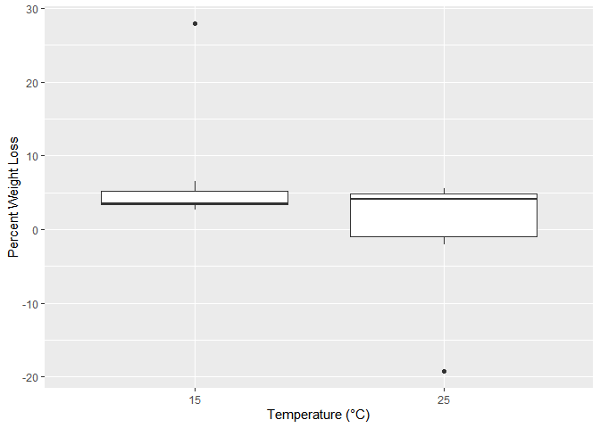<!-- -->


``` r
# Calculate Summary Statistics
summary_stats <- plastic %>%
  group_by(Temperature_C, Culture_Present, Nutrient_Present) %>%
  summarise(
    mean_loss = mean(Percent_Weight_Loss, na.rm = TRUE),
    se_loss = sd(Percent_Weight_Loss, na.rm = TRUE) / sqrt(n()),
    .groups = "drop")

# Bar Plot of Average Percent Weight Loss
ggplot(summary_stats, aes(x = factor(Temperature_C), y = mean_loss, fill = Culture_Present)) +
  geom_bar(stat = "identity", position = position_dodge(0.9)) +
  geom_errorbar(aes(ymin = mean_loss - se_loss, ymax = mean_loss + se_loss),
                position = position_dodge(0.9), width = 0.2) +
  labs(x = "Temperature (°C)", y = "Mean Percent Weight Loss", fill = "Culture Present") +
  theme_minimal()
```

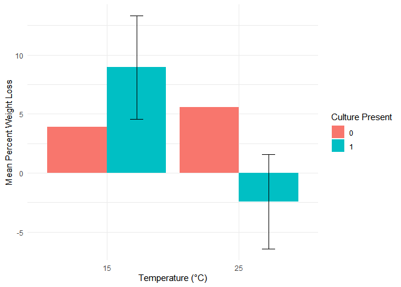<!-- -->

``` r
# mean loss having negative means that it actually grew

# Interaction Plot
interaction.plot(plastic$Temperature_C, plastic$Nutrient_Present, plastic$Percent_Weight_Loss)
```

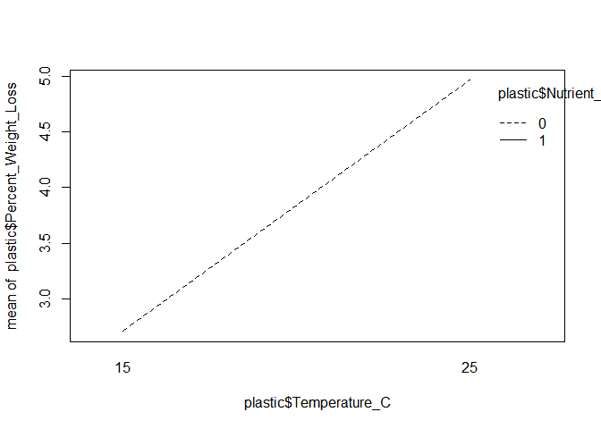<!-- -->


``` r
ggplot(summary_stats, aes(x = factor(Temperature_C), y = mean_loss, fill = Culture_Present)) +
  geom_bar(stat = "identity", position = position_dodge(0.9)) +
  geom_errorbar(aes(ymin = mean_loss - se_loss, ymax = mean_loss + se_loss),
                position = position_dodge(0.9), width = 0.2) +
  labs(x = "Temperature (°C)", y = "Mean Percent Weight Loss", fill = "Culture Present") +
  facet_wrap(~ Nutrient_Present) +
  theme_minimal()
```

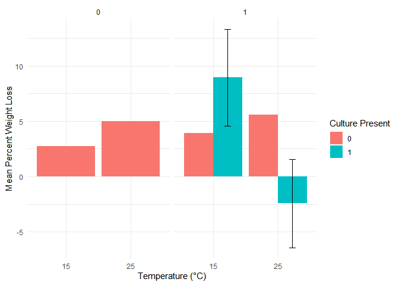<!-- -->


``` r
# Bar Plot with Facet Labels and Borders
ggplot(summary_stats, aes(x = factor(Temperature_C), y = mean_loss, fill = Culture_Present)) +
  geom_bar(stat = "identity", position = position_dodge(0.9)) +
  geom_errorbar(aes(ymin = mean_loss - se_loss, ymax = mean_loss + se_loss),
                position = position_dodge(0.9), width = 0.2) +
  labs(
    x = "Temperature (°C)",
    y = "Mean Percent Weight Loss",
    fill = "Culture Present"
  ) +
  facet_wrap(~ Nutrient_Present, labeller = labeller(Nutrient_Present = label_both)) +
  theme_minimal() +
  theme(
    strip.background = element_rect(fill = "lightgray", color = "black"), 
    strip.text = element_text(size = 12, face = "bold"), # Style facet labels
    panel.border = element_rect(color = "black", fill = NA, linewidth = 0.8) 
  )
```

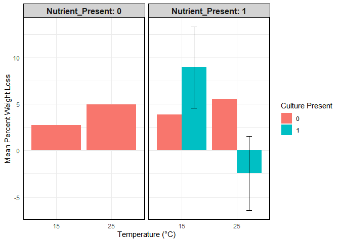<!-- -->


### looking at the negative loss (gain) category

``` r
# Filter the dataset for the negative mean category
negative_mean_data <- plastic %>%
  filter(Percent_Weight_Loss < 0)
negative_mean_data
```

```
##   Identifier Culture_Present Nutrient_Present Plastic_Present Temperature_C
## 1    CAPL002               1                1               1            25
## 2    CAPL004               1                1               1            25
##   Initial_Plastic_Weight_mg Culture_Volume_mL Nutrient_Volume_mL
## 1                    40.403                80                0.4
## 2                    32.477                80                0.4
##   Final_Plastic_Weight_mg Control_or_Replicate       MC Tube WL ExpStartDate
## 1                  41.216            Replicate MCMIX004    2 WW   2024-09-27
## 2                  38.700            Replicate MCMIX004    4 WW   2024-09-27
##            ExpEndDate Project Wall_Growth_RFU Suspension_RFU perc_change
## 1 2024-10-29 10:00:00 Plastic         1019.53          3.755    2.012227
## 2 2024-10-29 10:00:00 Plastic         2102.13         12.855   19.161253
##   Percent_Weight_Loss
## 1           -2.012227
## 2          -19.161253
```

XXX references


